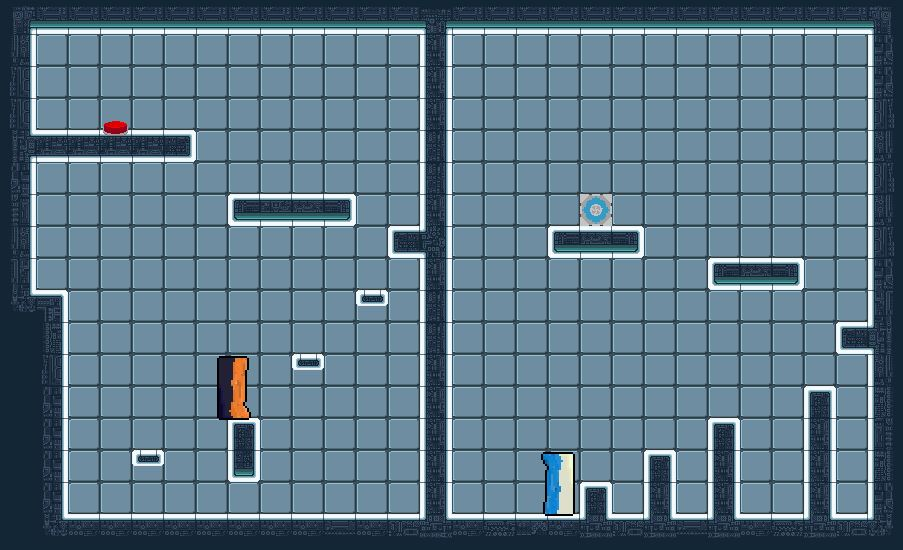

Thinking As Portals is a short puzzle platformer made in ~30 hours by Calverin, J70, and ChipChase for the 2023 GMTK Game Jam for the theme "Roles Reversed" in Godot. (Top %20 Overall, top %3 in Creativity)

